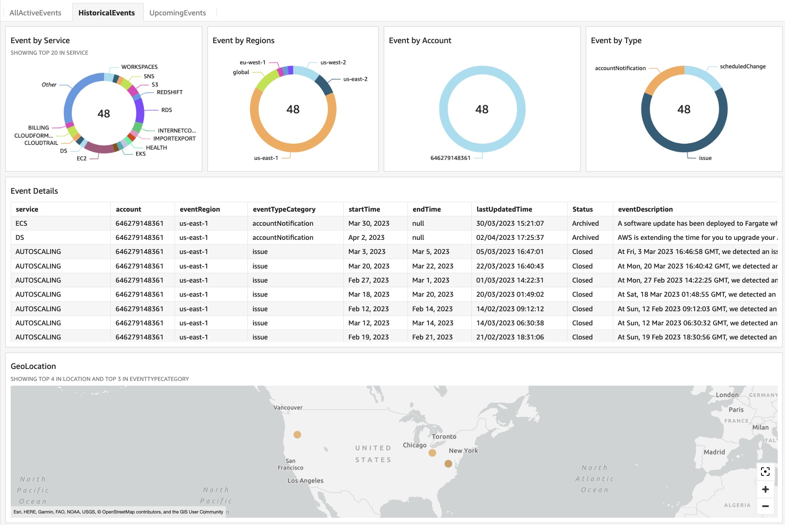

# AWS Health Events Insight

AWS Health serves as the primary means to inform users of service degradation, planned modifications, and issues that may impact their resources. Teams or engineers can go to aws health dashboard and find open events or historical events or scheduled changes. However, they may not always have access to the AWS Health console, and managing communications across multiple accounts and regions can be difficult. Moreover, essential notifications may get lost amid a large volume of data. This solution creates a quicksight dashboard which help teams to visualize open events, historical events and upcoming events across all accounts,regions and even different organizations.  

# Overview

This solution offers a centralized approach to store, analyze AWS Health events. The automation of capturing and storing events using EventBridge and Lambda reduces the effort required to access different accounts, regions and organizations. Furthermore, the use of QuickSight to visualize the consolidated AWS Health events stored in DynamoDB provides engineers with a robust tool to monitor the health of their AWS resources. 

# Architecture

AWS Health events are generated by the AWS Health service in each account and region. These events include issues, scheduled maintenances, and account notifications. The AWS Health events are sent to the default event bus in the account and region where they are generated. An EventBridge rule is set up on the default event bus to forward the events to an organizational event health bus. This helps to centralize the events and simplify management. Another EventBridge rule is set up on the organizational event health bus to receive the events and trigger a Lambda function. The Lambda function receives the AWS Health events and stores them in DynamoDB. DynamoDB provides a scalable and reliable NoSQL database for storing the events. Amazon QuickSight is used to consume the consolidated events stored in DynamoDB and display them on a customizable dashboard. QuickSight provides a range of visualization options, such as charts, tables, and graphs, to help users analyze and monitor the AWS Health events.

 

# Prerequisites

1. Before you use the AWS Health APIs, you need to have a business or enterprise support plan from AWS Support.
2. Sign up for QuickSight if you have never used QuickSight in this account before. To use the forecast capability in QuickSight, sign up for the Enterprise Edition.
3. Verify Quicksight access to Amazon Athena Service. To enable, go to security and permissions under managed quicksight
4. we will use SPICE to hold data. Go to spice capacity under manage quicksight and verify you have 1GB spice.
5. Go to Quicksight and find quicksight username who will own QuickSight Analysis.

# Deploying the solution

In this section, we go through the steps to set up permissions for StackSets in both the central and member accounts.

1. **Control Account Setup:** Setup scripts provided in this repo will set up all the necessary components required to receive AWS health events from other accounts. This can be payer or any other regular account which would receive AWS health data from all other accounts and regions. 

    1. To start, clone AWShealtheventqs repo

    `git clone https://github.com/aws-samples/aws-health-events-insight.git`

    2. Go to AWShealtheventqs directory and run ControlAccountSetup.py and provide account specific inputs.

    `cd aws-health-events-insight`

    `python3 ControlAccountSetup.py`

    **Note:** if you're running this script from your local machine, ensure that you have set up AWS credentials properly and have `boto3` , `subprocess` and `botocore.exceptions`  modules. Alternatively, you can use CloudShell, which automatically inherits the login role and have all the required modules with python3.

    3. Go to cloudformation and wait until Status changes to CREATE_COMPLETE (roughly 5-10 minutes). Once status is CREATE_COMPLETE, go to quicksight dashboard and verify analysis. At this point, you must have atleast one event in analysis under historical tab.

2. **Child Account Setup:** Cloufdormation template in  will set up all the necessary components required to send health events from management accounts. You can also use stacksets to deploy into multiple accounts and regions.

    1. In CloudFormation Console create a stack with new resources from the template file  .
    2. Input HealthBus ARN. Go to aws cloudformation console and get this information from output of stack(HealthEventDashboardStack).
    3. Launch the stack.

3. **Testing:** Send Mockevent to test eventpipeline

    1. Go to Amazon EventBridge console and chose default event bus. (You can chose any account or region) and select send events.
    2. **Important** Put Event source as "awshealthtest" , otherwise EB rule will discard this event.
    3. Copy json from  and paste in events hit send
    4. You will see event in dynamoDB. For event to reflect in AWS analysis, make sure you refresh the quicksight dataset.

# Performance Test

This solution has two lambds. One to put event in DynamoDB and another as part of fedrated query package. We stress test against lambda for fedrated query. This lambda must read dynamodb and retrun results to quicksight in less than 60 secs.

Event count: 108,666 TIme to refresh: 47secs.
