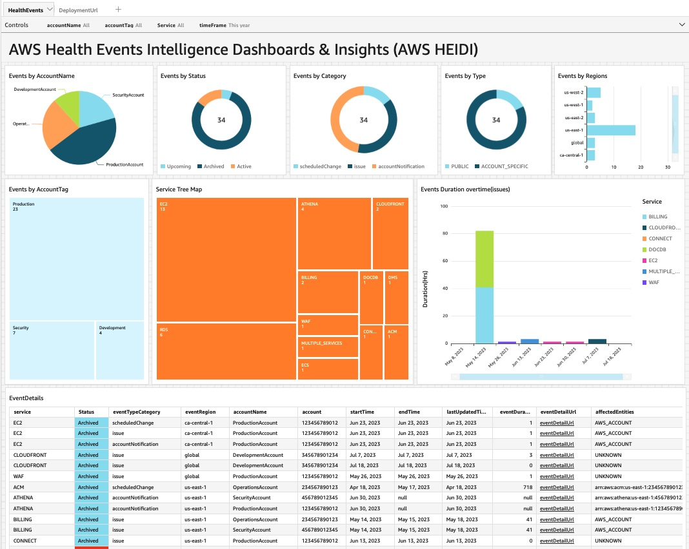
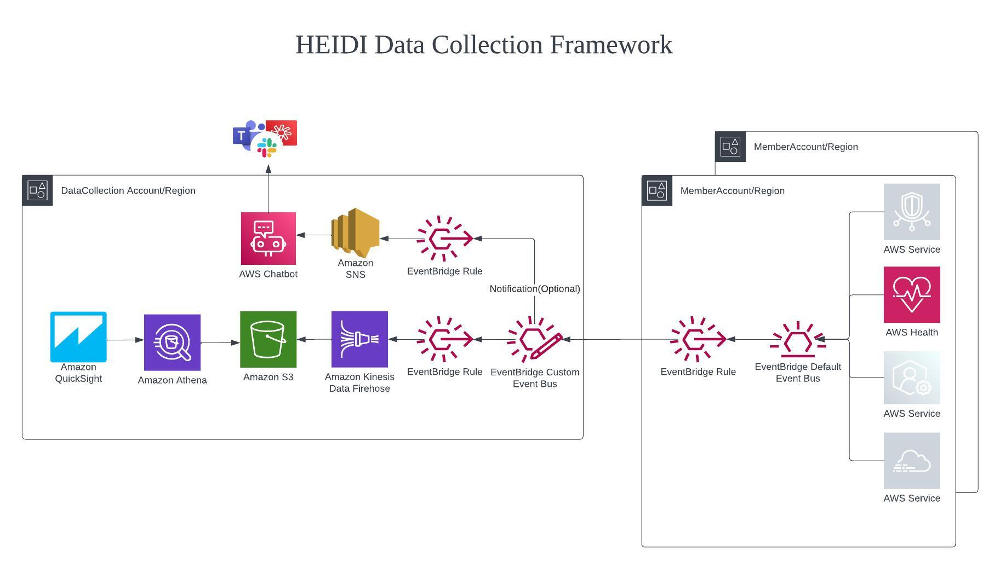
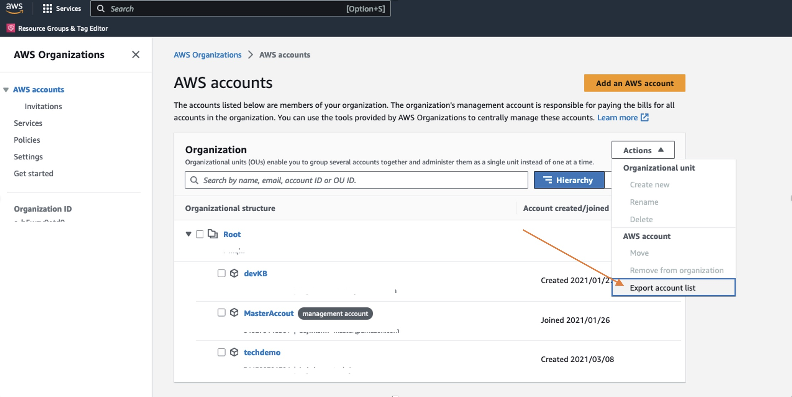
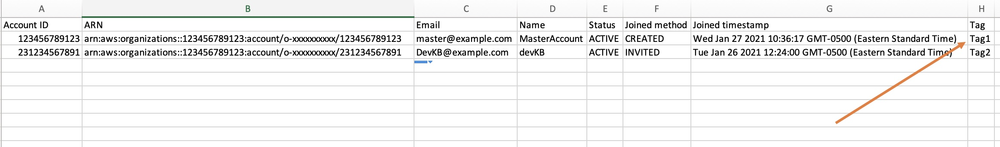
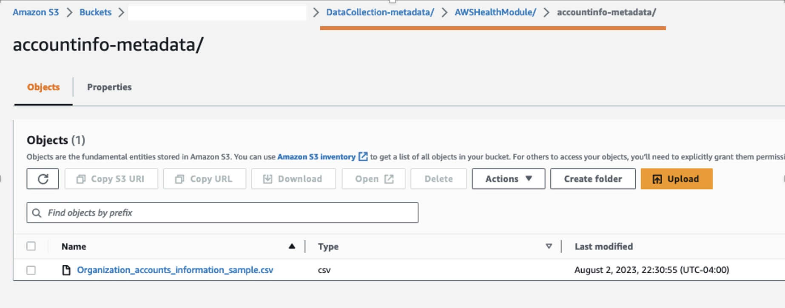

# Overview

AWS Health Events Intelligence Dashboards and Insights (AWS HEIDI) solution offers a centralized approach to store and analyze AWS Health events. AWS Health serves as the primary means to inform users of service degradation, planned modifications, and issues that may impact their AWS resources. Teams or engineers can go to the AWS health dashboard to find open events, historical events, or scheduled changes. However, they may not always have access to the AWS Health console, and managing communications across multiple accounts, organizations and regions can be difficult. AWS HEIDI provides single pane of glass across different different accounts, regions and organizations. 

 

# Architecture

AWS HEIDI Data Collection Framework enables you to collect data from different different accounts, regions and organizations. AWS Health events are generated by the AWS Health service in each account and region. These events include issues, scheduled maintenances, and account notifications. The AWS Health events are sent to the default Amazon EventBridge bus in the account and region where they are generated. An Amazon Event Bridge rule is set up on the default event bus to forward the events to an central event health bus. This helps to centralize the events and simplify management. Another Amazon EventBridge rule is set up on the central event health bus to send events to Amazon Kinesis Firehose which then put events in S3. Amazon QuickSight is used to consume the consolidated events stored in S3 and display them on a customizable dashboard. 

 

# Deploying the solution

In this section, we will go through the steps to set up permissions for StackSets in both the central and member accounts for AWS Health Events..

# Prerequisites

1. To backfill the events the solution use AWS Health API. You need to have a Business Support, Enterprise On-Ramp or Enterprise Support plan from AWS Support in order to use this API.
2. Sign up for Amazon QuickSight if you have never used it in this account. To use the forecast capability in QuickSight, sign up for the Enterprise Edition.
3. Verify Amazon QuickSight service has access to Amazon Athena. To enable, go to security and permissions under *manage QuickSight*.
4. AWS Health Event Dashboard will use  to hold data. Go to SPICE capacity under manage QuickSight and verify you have required space.

# Deployment

1. **Central Account Setup for AWS Health Events:** The setup script provided in this repo will set up all the necessary components required to receive AWS health events from other accounts. This can be payer or any other regular AWS account which would receive AWS Health data from all other accounts and regions. 

    1. To start, Login to your AWS account and launch `AWS CloudShell` and clone aws-health-events-insight repo.

    `git clone https://github.com/aws-samples/aws-health-events-insight.git`

    2. Go to aws-health-events-insight directory and run ControlAccountSetup.py and provide account specific inputs.

    `cd aws-health-events-insight/src`

    `python3 OneClickSetup.py`

    3. Once CloudFormation status changes to **CREATE_COMPLETE** (about 10-15 minutes), go to Amazon QuickSight dashboard and verify the analysis deployed. 

2. **Member Account/Region Setup for AWS Health Events:** CloudFormation template in  will set up all the necessary components required to send health events to control account. 

    **Option 1 (Using One click Script):**

    1. Setup AWS credntials for desired Account and Regions.
    2. Go to aws-health-events-insight directory and run python3 OneClickSetup.py and provide necessary inputs. 

    `cd aws-health-events-insight/src`

    `python3 OneClickSetup.py`

    **Option 2 (Bulk deployment via StackSet)**:

    1. In CloudFormation Console create a stackset with new resources from the template file .
    2. Input the DataCollectionBusArn. Go to the AWS CloudFormation console of central account and get this information from output of DataCollectionStack.
    3. Select deployment targets (Deploy to OU or deploy to organization).
    4. Select regions to deploy.
    5. Submit.

**Note:** You MUST complete Member Account Setup for each Region for which you want to receive AWS Health events. To receive global events, you must create Member Account/Region Setup for the US East (N. Virginia) Region and US West (Oregon) Region as backup Region if needed.

3. **Update Metadata (Optional):** Map AWS Accounts with Account Name and Account Tags (AppID, Env, etc.)

    1. Go to AWS organizations and export the account list. This is delegated AWS organization account. If you don't have access or somehow can't get the export list, you can create one from [this sample file](https://github.com/aws-samples/aws-health-events-insight/blob/main/src/AWSHealthModule/accountinfo-metadata/Organization_accounts_information_sample.csv).

   

    2. For Account Tag, open the file in Excel and add the Tag field as shown below.

   

    3. **Important:** Upload the file to a specific S3 location so that Amazon QuickSight dataset can join to create mapping.

   

4. **Testing (Optional):** Send a mock event to test setup.

    1. Go to Amazon EventBridge console and chose default event bus. (You can chose any member account or region) and select send events.
    2. **Important** Put the `event source` and `Detail Type` as **"awshealthtest"** , otherwise the rule will discard mock event.
    3. Copy the json from  and paste it in the events field, hit send
    4. You will see the event in Amazon S3. For event to reflect in Amazon QuickSight analysis, make sure you refresh the Amazon QuickSight dataset.

# Troubleshooting Steps:

**Template format error: Unrecognized resource types: [AWS::QuickSight::RefreshSchedule]**

`AWS::QuickSight::RefreshSchedule` doesn't exist in certain regions such as us-west-1, ca-central-1 etc. You can comment out `AWSHealthEventQSDataSetRefresh` section in  and setup refresh schedule from QuickSight console. 

**Resource handler returned message: Insufficient permissions to execute the query. Insufficient Lake Formation permission(s) on awshealthevent**

1. Navigate to Lakeformation and go to the "Permissions" tab.
2. Under "Data Lake Permissions," select "Grant."
3.  Choose "SAML users and groups."
4. **Important:** Provide the Amazon QuickSight ARN. This ARN represents the role that owns (or authors) the dataset.
5. From the dropdown menu, select the "awshealthdb" database and grant the necessary permission.
6. Repeat the previous step (Step 5), but this time, select all tables and grant the required permission.

By following these steps, you should be able to resolve the "Insufficient Lake Formation permission(s) on awshealthevent" issue. This will grant the necessary permissions to the specified Amazon QuickSight ARN and allow it to access the AWS Lake Formation resources correctly. You must repeate same process for Amazon QuickSight service role if thats also lacking these permissions.

**Possible Reasons for No Data in AWS QuickSight Analysis:**

1. Your AWS environment is relatively new and does not currently have any AWS Health Events. To verify this, please check the AWS Health Dashboard on the AWS Console and send mock event.
2. The Amazon QuickSight DataSet was created before the event could be backfilled by Amazon Kinesis Firehose. To resolve this, manually refresh the Amazon QuickSight DataSet.

