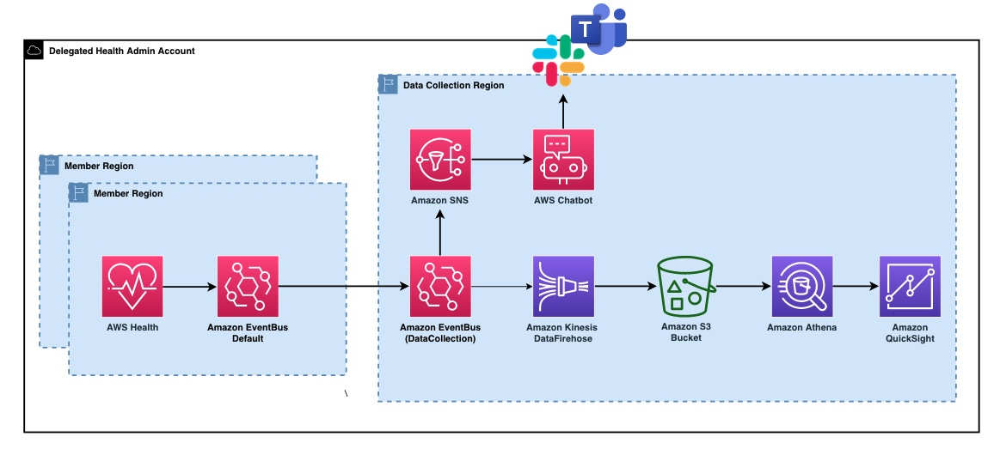

## **Health Events Intelligence Dashboards and Insights (HEIDI)**
Single pane of glass for all your Health events across different accounts, regions and organizations.

## **Table of Contents**
- [What's New?](#whats-new)
- [Solution Architecture](#solution-architecture)
- [Modules](#modules)
- [Prerequisites](#prerequisites)
- [Installation](#installation)
    - [Data Collection Account Setup](#data-collection-account-setup)
    - [Member Setup](#member-setup)
- [Update Metadata](#update-metadata-optional)
- [Backfill HealthEvents](#backfill-healthevents-optional)
- [Setup Validation](#setup-validation)
- [Troubleshooting](#troubleshooting)

## **Whats New?**
*NEW:* Heidi now presents an efficient mechanism for data collection, visualization, and notifications. Operating on an event-driven model, Heidi simplifies the collection of data from various AWS services across numerous accounts within multiple AWS organizations. Heidi generates QuickSight dashboard that is designed to streamline the monitoring of AWS events in a user-friendly format, enabling customers to conveniently access a comprehensive overview without the need to log in to each individual AWS account. 

Heidi consists of following Modules.

* Health Module (Unified view of Upcoming events, Planned events(EOL) scheduled events and issues across all AWS Accounts and AWS Organizations)
* Notification Module (Powered by AWSChat bot to get Notification on Slack or Teams)

## **Solution Architecture**

HEIDI Data Collection Framework enables you to collect data from different accounts, regions and organizations. The following diagram illustrates a multi-account structure. The DataCollection Account refers to the account which will display the unified Amazon QuickSight dashboard, and will receive events routed from the current account as well as all other accounts within your AWS Organizations. The link accounts refer to any accounts other than the DataCollection Account, routing enriched events to the DataCollection Account. The DataCollection architecture consists of an AWS EventBridge custom bus, an AWS EventBridge rule, an AWS Lambda function and Amazon S3 bucket. The presentation layer includes an Amazon Quicksight dashboard and Amazon Athena as the query engine. 

1. AWS services generate events, which are sent to the default event bus in member/linked accounts.
2. A corresponding Event Bridge rule on the default event bus directs events to a centralized bus upon pattern matching.
3. The centralized event bus then routes the events to Kinesis.
4. Kinesis Data Firehose processes and stores the events in S3 buckets.
5. Athena queries the S3 buckets.
6. QuickSight provides insights into the events.

 

## **Prerequisites**

1. To backfill your existing health events, the solution use AWS Health API. You need to have a Business Support, Enterprise On-Ramp or Enterprise Support plan from AWS Support in order to use this API.
2. Sign up for QuickSight if you have never used it in the Data Collection account. To use the forecast capability in QuickSight, sign up for the Enterprise Edition.
3. Verify QuickSight service has access to Amazon Athena. To enable, go to security and permissions under *manage QuickSight*.
4. AWS Health Event Dashboard will use [SPICE](https://docs.aws.amazon.com/quicksight/latest/user/spice.html) to hold data. Go to SPICE capacity under manage QuickSight and verify you have required space.

## **Installation**

In this section, we are going to walk through the procedure for configuring HEIDI within both the Data Collection and Member accounts for AWS Health Events.

### **Data Collection Setup**

The setup script provided in this repo will set up all the necessary components required to receive AWS health events from other accounts. This can be your payer/organization or any other linked/member AWS account which you designate to receive AWS Health data from other HEIDI Member accounts and regions. 

1. To start, log in to your AWS console and launch **AWS CloudShell** and clone aws-health-events-insight repo. You can use your local environment provided that you have assumed a role with necessary permissions to deploy the solution.

        git clone https://github.com/aws-samples/aws-health-events-insight.git

2. Go to `aws-health-events-insight` directory and run `OneClickSetup.py` and provide account specific inputs. The setup script will generate a CloudFormation stack to deploy all necessary AWS resources, including the QuickSight dashboard. 

        cd aws-health-events-insight/src/Setup
        python3 OneClickSetup.py

3. Once CloudFormation status changes to **CREATE_COMPLETE** (about 10-15 minutes), go to QuickSight Analysis and verify the initial deployment. 

### **Member Setup**

**Note:** If you are deploying HEIDI in the health delegated admin account, You dont need to run member setup in any other link account within the organization. 

You can now receive a feed of AWS Health events on Amazon EventBridge from all accounts within your organization in AWS Organizations using organizational view and delegated administrator. With this feature, if you are deploying HEIDI in the health delegated administrator account, it will ingest AWS Health events from all other accounts. Amazon EventBridge is a regional service. You must still run member setup in AWS Organizations or delegated health admin account for the regions where you wish to receive events. 

If you have additional Payer/Organization IDs, you are also required to run member setup within the delegated health admin account for each additional Payer. 

#### (Option 1) One Click Setup Script to add Member Region
1. Setup AWS credentials for DataCollection Account. Or, log in to your AWS console and launch **AWS CloudShell**.
2. Go to `aws-health-events-insight` directory and run `OneClickSetup.py` and select `Member Setup` provide necessary inputs. 

        cd aws-health-events-insight/src/Setup
        python3 OneClickSetup.py

#### (Option 2) Bulk deployment via CloudFormation StackSet
1. In CloudFormation console, create a StackSet with new resources from the template file [HealthModuleCollectionSetup.yaml](https://github.com/aws-samples/aws-health-events-insight/blob/main/src/HealthModule/HealthModuleCollectionSetup.yaml).
2. Input variables
3. Select deployment targets (Deploy to OU or deploy to organization).
4. Select regions to deploy.
5. Submit.

**Note:** If you are NOT deploying HEIDI in the health delegated admin account, you MUST complete Member Setup for each Link Account and Region for which you want to receive events. To receive global events, you must create Member account/region setup for the US East (N. Virginia) region and US West (Oregon) Region as the backup region if needed.

## **Update Metadata (optional)**
This is an optional step. You can map AWS AccountIDs with Account Name and Account Tags (AppID, Env, etc.)

1. From your Payer/Organization account, go to AWS Organizations and export the account list. If you don't have access or can't get the export list, you can create one from [this sample file](https://github.com/aws-samples/aws-health-events-insight/blob/main/src/ReferenceOds/AccountsInfo/Organization_accounts_information_sample.csv).

   

2. For Account Tag, edit the account list CSV file and add the Tag field as shown below.

   

3. **Important:** Upload the file to a specific Amazon S3 location so that QuickSight dataset can join the data and create mapping. 

   

## **Setup Validation**
Send a mock event to test setup.

1. Go to EventBridge console and choose default event bus. (You can choose any member account or region) and click the **Send events** button.
2. **Important** Put the **Event source** and **Detail type** as `heidi.health` , otherwise the rule will discard the mock event.
3. Copy the entire content from [MockEvent.json](https://github.com/aws-samples/aws-health-events-insight/blob/main/src/HealthModule/MockHealthEvent.json) and paste it in the **Event detail** field.
4. Click **Send**.

You will see the event in Amazon S3. For the mock event to reflect in QuickSight sooner, you can refresh the QuickSight dataset manually.

## **Backfill HealthEvents (optional)**

**Note** By default, Heidi does not automatically backfill older health events. However, you can manually perform this task using the [HealthEventBackFill.py](https://github.com/aws-samples/aws-health-events-insight/blob/main/src/Setup/utils/HealthEventBackFill.py) script.

Go to `aws-health-events-insight` directory and run `HealthEventBackFill.py` and provide necessary inputs. 

        cd aws-health-events-insight/src/Setup/utils
        python3 HealthEventBackFill.py

Ensure to execute this script in the specific AWS account for which you intend to backfill the events. 

## **FAQ**

**Q: Does HEIDI support multiple payer/AWS organizations?**\
**A:** Yes, HEIDI allows you to include additional organizational IDs during deployment.

**Q: Is member setup required in all linked accounts?**\
**A:** No, if the data collection deployment is in the delegated health admin account, member setup is NOT required in all linked accounts. See Member Setup for more details.

**Q: What is the cost of the Heidi solution?**\
**A:** The cost varies depending on the number of notifications. For up to 1 million notifications per month, it's approximately $30 including QuickSight licencing cost. For more details see [calculations](https://calculator.aws/#/estimate?id=a5243df5c6b91c413a8b535d292e480f34bdb030).

## **Troubleshooting**

#### ***1. SYNTAX_ERROR: line 41:15: UNNEST on other than the right side of CROSS JOIN is not supported***

This implies that you are using Athena V2. Please upgrade worker to Athena V3. Athena V2 is on deprecated path.

#### ***2. Template format error: Unrecognized resource types: [AWS::QuickSight::RefreshSchedule]***

`AWS::QuickSight::RefreshSchedule` does not exist in certain regions such as us-west-1, ca-central-1 etc. You can comment out `AWSHealthEventQSDataSetRefresh` section in [AWSHealthEventQSDataSet.yaml](https://github.com/aws-samples/aws-health-events-insight/blob/main/src/HealthModule/HealthModuleDataSetSetup.yaml) and setup refresh schedule from QuickSight console. 

#### ***3. Resource handler returned message: Insufficient permissions to execute the query. Insufficient Lake Formation permission(s) on heididatacollectiondb***

In case Lakeformation is enabled, both the QuickSight Analysis author and the QuickSight Service Role need to provide access permissions for the heididatacollectiondb database and all associated tables.

1. Navigate to Lakeformation and go to the "Permissions" tab.
2. Under "Data Lake Permissions," select "Grant."
3.  Choose "SAML users and groups."
4. **Important:** Provide the QuickSight ARN. This ARN represents the role that owns (or authors) the dataset.
5. From the dropdown menu, select the "heididatacollectiondb" database and grant the necessary permission.
6. Repeat the previous step (Step 5), but this time, select all tables and grant the required permission.
Repeat same process for QuickSight Service Role.

#### ***4. Possible Reasons for No Data in AWS QuickSight Analysis:***

1. Your AWS environment is relatively new and does not currently have any AWS Health Events. To verify this, please check the AWS Health Dashboard on the AWS Console and send mock event.
2. The QuickSight DataSet was created before the event could be backfilled by Kinesis Data Firehose. To resolve this, manually refresh the QuickSight DataSet.

#### ***5. Not getting Notifications on Slack/Team:***

1. Go to EventBridge and see if it has failures sending events to SNS. It's possible that SNS is encrypted with KMS keys which is not accessible by EventBridge service role. 
2. Your Amazon SNS topic must use an AWS KMS key that is customer managed. Visit [SNS-EB-Notification](https://repost.aws/knowledge-center/sns-not-getting-eventbridge-notification) to learn more. 

