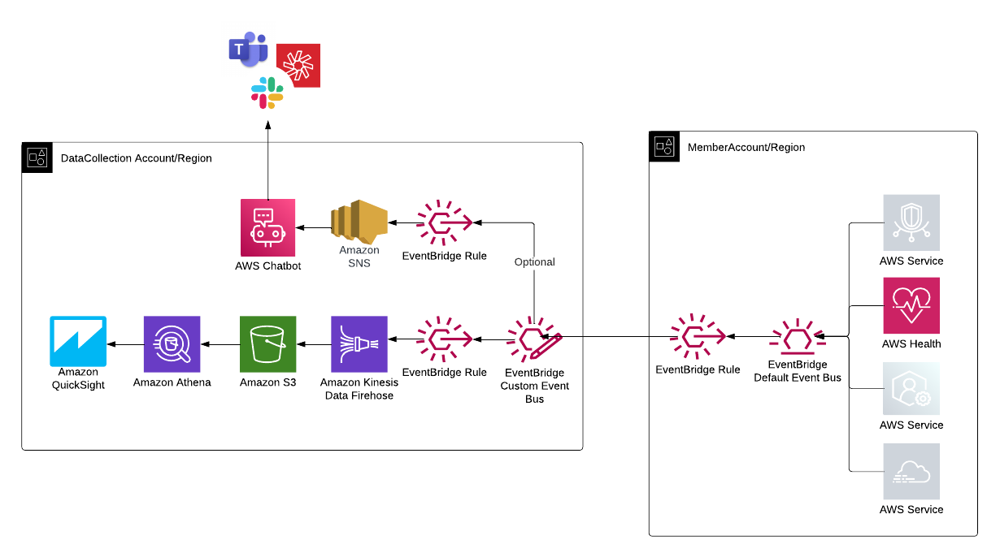

## **AWS Health Events Intelligence Dashboards and Insights (HEIDI)**
Single pane of glass for all your AWS Health events across different accounts,regions and organizations.

## **Table of Contents**
- [Whats New](#whats-new)
- [Introduction](#introduction)
- [Solution Architecture](#solution-architecture)
- [Prerequisites](#prerequisites)
- [Installation](#installation)
    - [Data Collection Account Setup](#data-collection-account-setup)
    - [Member Setup](#member-setup)
- [Update Metadata](#update-metadata)
- [Setup Validation](#setup-validation)
- [Troubleshooting](#troubleshooting)

## **Whats New?**
You can now receive a feed of AWS Health events on Amazon EventBridge from all accounts within your organization in AWS Organizations using organizational view and delegated administrator. With this feature, if you are deploying Heidi in the delegated administrator account, it will ingest AWS Health events from all other accounts. 

**Note:** EventBridge is a regional service, meaning you should set up member configurations in the specific region where you want to receive events. For example, if your operate in us-east-1 and us-east-2, you can deploy Heidi in us-east-1 and configure the member setup in us-east-2 within the delegated admin account.

## **Introduction**

AWS Health Events Intelligence Dashboards and Insights (HEIDI) solution offers a centralized approach to store and analyze AWS Health events. AWS Health serves as the primary means of informing users of service degradation, planned modifications, and issues that may impact their AWS resources. Teams or engineers can go to the AWS health dashboard to find open events, historical events, or scheduled changes. However, they may not always have access to the AWS Health console, and managing communications across multiple accounts, organizations and regions can be difficult. HEIDI provides single pane of glass across different accounts, regions and organizations. 

The following illustration shows the sample dashboard:

 

## **Solution Architecture**

HEIDI Data Collection Framework enables you to collect data from different accounts, regions and organizations. AWS Health events are generated by the AWS Health service in each account and region. These events include issues, scheduled maintenances, and account notifications. The AWS Health events are sent to the default Amazon EventBridge bus in the account and region where they are generated. An  EventBridge rule is set up on the default event bus to forward the events to an Data Collection event health bus. This helps to centralize the events and simplify management. Another EventBridge rule is set up on the Data Collection event health bus to send events to an Amazon Kinesis Data Firehose which then put events in Amazon S3. Amazon QuickSight is used to consume the consolidated events stored in Amazon S3 and display them on a customizable dashboard. 

 

### **Additional Optional Features**
- HEIDI can enrich incoming AWS Health Events with data such as Resource Tags, Availability Zone, Resource ARN etc. via AWS Config. See [enrichEvent.md](https://github.com/aws-samples/aws-health-events-insight/blob/main/enrichEvent.md) for more details. 
- HEIDI can send incoming event notification to slack/teams/chime. see [notification.md](https://github.com/aws-samples/aws-health-events-insight/blob/main/notification.md) for more details.
- HEIDI provides option to create eventURL for easy sharing of single event. see [eventUrl.md](https://github.com/aws-samples/aws-health-events-insight/blob/main/eventURL.md) for more details.

## **Prerequisites**

1. To backfill the events the solution use AWS Health API. You need to have a Business Support, Enterprise On-Ramp or Enterprise Support plan from AWS Support in order to use this API.
2. Sign up for QuickSight if you have never used it in this account. To use the forecast capability in QuickSight, sign up for the Enterprise Edition.
3. Verify QuickSight service has access to Amazon Athena. To enable, go to security and permissions under *manage QuickSight*.
4. AWS Health Event Dashboard will use [SPICE](https://docs.aws.amazon.com/quicksight/latest/user/spice.html) to hold data. Go to SPICE capacity under manage QuickSight and verify you have required space.

## **Installation**

In this section, We are going to walk through the procedures for configuring HEIDI within both the Data Collection and Member accounts for AWS Health Events.

### **Data Collection Account Setup**

The setup script provided in this repo will set up all the necessary components required to receive AWS health events from other accounts. This can be payer or any other regular AWS account which would receive AWS Health data from all other accounts and regions. 

1. To start, Login to your AWS account and launch `AWS CloudShell` and clone aws-health-events-insight repo.

        git clone https://github.com/aws-samples/aws-health-events-insight.git

2. Go to aws-health-events-insight directory and run OneClickSetup.py and provide account specific inputs.

        cd aws-health-events-insight/src
        python3 OneClickSetup.py

3.  Once CloudFormation status changes to **CREATE_COMPLETE** (about 10-15 minutes), go to QuickSight dashboard and verify the analysis deployed. 

4. (Optional). To receive AWS Events from various AWS Organizations and Payers, you must update the permission policy for DataCollectionBus-{accountID} Event Bus.
   1. Go to EventBridge Console and select Event Buses on your left.
   2. Select DataCollectionBus-{accountID} Event Bus.
   3. Select manage permission and add Organizational ID from other AWS Org. e.g. `"aws:PrincipalOrgID": ["o-abcdef","o-jklmoprq"]`

### **Member Setup**

You MUST complete Member Setup for each Region and Account(same or different Payer) for which you want to receive AWS Health events.

### (Option1) One Click Setup Script
1. Setup AWS credentials for desired Account and Regions.
2. Go to aws-health-events-insight directory and run python3 OneClickSetup.py and provide necessary inputs. 

        cd aws-health-events-insight/src
        python3 OneClickSetup.py

### (Option2) Bulk deployment via StackSet
1. In CloudFormation Console create a stackset with new resources from the template file [HealthEventMember.yaml](https://github.com/aws-samples/aws-health-events-insight/blob/main/src/AWSHealthModule/cfnTemplates/HealthEventMember.yaml).
2. Input the DataCollectionBusArn. Go to the AWS CloudFormation console of Data Collection account and get this information from output of DataCollectionStack.
3. Select deployment targets (Deploy to OU or deploy to organization).
4. Select regions to deploy.
5. Submit.

**Note:** To receive global events, you must create Member Account/Region Setup for the US East (N. Virginia) Region and US West (Oregon) Region as backup Region if needed.

## **Update Metadata**
This is an optional step. You can map AWS AccountIDs with Account Name and Account Tags (AppID, Env, etc.)

1. Go to Organizations and export the account list. This is delegated Organizations account. If you don't have access or somehow can't get the export list, you can create one from [this sample file](https://github.com/aws-samples/aws-health-events-insight/blob/main/src/AWSHealthModule/accountinfo-metadata/Organization_accounts_information_sample.csv).

   

2. For Account Tag, open the file in Excel and add the Tag field as shown below.

   

3. **Important:** Upload the file to a specific Amazon S3 location so that QuickSight dataset can join to create mapping.

   

## **Setup Validation**
Send a mock event to test setup.

1. Go to EventBridge console and chose default event bus. (You can chose any member account or region) and select send events.
2. **Important** Put the `event source` and `Detail Type` as **"awshealthtest"** , otherwise the rule will discard mock event.
3. Copy the json from [MockEvent.json](https://github.com/aws-samples/aws-health-events-insight/blob/main/src/MockEvent.json) and paste it in the events field, hit send

You will see the event in Amazon S3. For event to reflect in QuickSight analysis, make sure you refresh the QuickSight dataset.

## **Troubleshooting**

#### ***1. SYNTAX_ERROR: line 41:15: UNNEST on other than the right side of CROSS JOIN is not supported***

This implies that you are using Athena V2. Please upgrade worker to Athena V3. Athena V2 is on deprecated path.

#### ***2. Template format error: Unrecognized resource types: [AWS::QuickSight::RefreshSchedule]***

`AWS::QuickSight::RefreshSchedule` does not exist in certain regions such as us-west-1, ca-central-1 etc. You can comment out `AWSHealthEventQSDataSetRefresh` section in [AWSHealthEventQSDataSet.yaml](https://github.com/aws-samples/aws-health-events-insight/blob/main/src/AWSHealthModule/cfnTemplates/QSDataSetHealthEvent.yaml) and setup refresh schedule from QuickSight console. 

#### ***3. Resource handler returned message: Insufficient permissions to execute the query. Insufficient Lake Formation permission(s) on awshealthevent***

In case Lakeformation is enabled, both the QuickSight Analysis author and the QuickSight Service Role need to provide access permissions for the awshealthdb database and all associated tables.

1. Navigate to Lakeformation and go to the "Permissions" tab.
2. Under "Data Lake Permissions," select "Grant."
3.  Choose "SAML users and groups."
4. **Important:** Provide the QuickSight ARN. This ARN represents the role that owns (or authors) the dataset.
5. From the dropdown menu, select the "awshealthdb" database and grant the necessary permission.
6. Repeat the previous step (Step 5), but this time, select all tables and grant the required permission.
Repeat same process for QuickSight Service Role.

#### ***4. Possible Reasons for No Data in AWS QuickSight Analysis:***

1. Your AWS environment is relatively new and does not currently have any AWS Health Events. To verify this, please check the AWS Health Dashboard on the AWS Console and send mock event.
2. The QuickSight DataSet was created before the event could be backfilled by Kinesis Data Firehose. To resolve this, manually refresh the QuickSight DataSet.

#### ***5. Not getting Notifications on slack/Team:***

1. Go to EventBridge and see if EB has failures sending events to SNS. Its possible that SNS is encrypted with KMS keys which is not accessible by EventBridge service role. 
2. Your Amazon SNS topic must use an AWS KMS key that is customer managed. Visit [SNS-EB-Notification](https://repost.aws/knowledge-center/sns-not-getting-eventbridge-notification) to learn more. 

