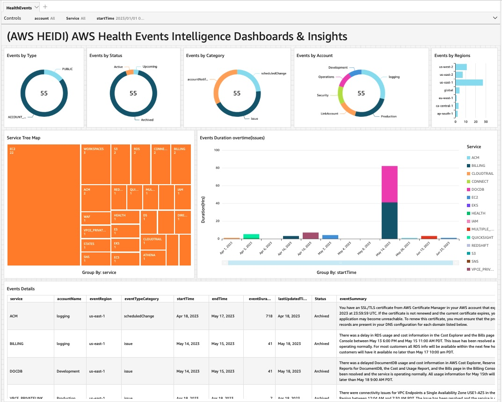
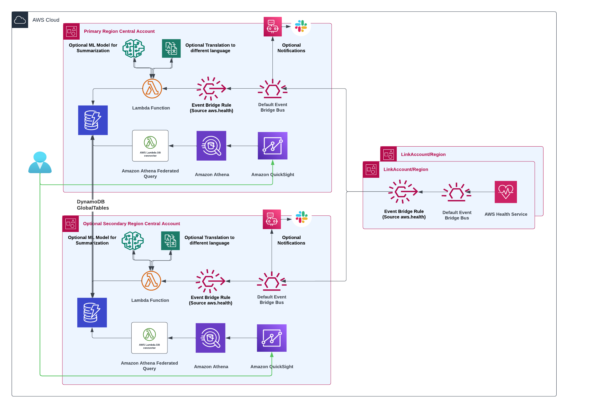

# AWS Health Events Intelligence Dashboards and Insights (AWS HEIDI)

AWS Health serves as the primary means to inform users of service degradation, planned modifications, and issues that may impact their AWS resources. Teams or engineers can go to the AWS health dashboard to find open events, historical events, or scheduled changes. However, they may not always have access to the AWS Health console, and managing communications across multiple accounts and regions can be difficult. Moreover, essential notifications may get lost amid a large volume of data. This solution creates an Amazon QuickSight dashboard that helps users to visualize open events, historical events and upcoming events across all accounts,regions, and even different organizations. Optionally, events can be presented in a more user-friendly format by integrating with Amazon SageMaker for summarization, and translated into a language of choice by using Amazon Translate. Also, you have ability to deploy this solution in multiple regions.

# Overview

The AWS HEIDI solution offers a centralized approach to store and analyze AWS Health events. The automation of capturing and storing events using Amazon EventBridge and AWS Lambda reduces the effort required to access different accounts, regions and organizations. Furthermore, the use of Amazon QuickSight to visualize the consolidated AWS Health events stored in Amazon DynamoDB provides users with a robust tool to monitor the health of their AWS resources. 

# Architecture

AWS Health events are generated by the AWS Health service in each account and region. These events include issues, scheduled maintenances, and account notifications.  

**Baseline:** AWS Health events are initially sent to the default Amazon EventBridge bus. A rule is configured on this bus to forward the events to a central event health bus, simplifying event management. Another rule on the organizational event health bus triggers a Lambda function that stores the events in Amazon DynamoDB. Amazon QuickSight is used to consume and visualize the consolidated events, providing customizable dashboards with charts, tables, and graphs for effective monitoring and analysis.

 

**Optional features:** You have the choice to integrate with Amazon SageMaker for summarization. Additionally, you can utilize Amazon Translate to receive events in various languages. You have the option to receive notifications through AWS Chatbot and AWS UserNotification. Furthermore, you can consume third-party events if you desire.

 

 **Multi-Region Deployment:** The sample solution provides you with the flexibility to deploy your central account across multiple regions. In the unlikely event of a region failure, you can seamlessly log in to a secondary region and continue accessing the information you need.

# Prerequisites

1. Before you use the AWS Health APIs, you need to have a Business Support, Enterprise On-Ramp or Enterprise Support plan from AWS Support.
2. Sign up for Amazon QuickSight if you have never used it in this account. To use the forecast capability in QuickSight, sign up for the Enterprise Edition.
3. Verify Amazon QuickSight service has access to Amazon Athena. To enable, go to security and permissions under *manage QuickSight*.
4. AWS HEIDI will use  to hold data. Go to SPICE capacity under manage QuickSight and verify you have required space.
5. **Optional:** To ensure that the account name is included in analyses, the central account needs to have the ability to describe AWS Organization accounts.
6. **Optional:** To incorporate event summarizations, you have the flexibility to utilize an Amazon Sagemaker Large Language Model (LLM). For this sample, we used huggingface-summarization-bart-large-cnn-samsum, an open-source text summerization model. By providing the model inference endpoint ARN as user input, you can include this functionality. Please see  to get started.
7. **Optional:** To enable notification functionality, AWS HEIDI offers support for notifications through the AWS UserNotification service and AWS Chatbot. With this feature, you can receive notifications delivered to platforms such as Slack, Microsoft Teams, and more. For the setup instructions, please refer to the  to configure notifications.
8. **Optional:** For multi-region setup, ensure you have QuickSight SPICE capacity in your secondary region as well.
9. **Optional:** You can ingest health events from different service provider. see  for more details.
10. **Optional:** The solution gives you option to deliver events to S3 as is for future reference/datalake.

# Deploying the solution

In this section, we will go through the steps to set up permissions for StackSets in both the central and member accounts.

1. **Control Account Setup:** The setup script provided in this repo will set up all the necessary components required to receive AWS health events from other accounts. This can be payer or any other regular AWS account which would receive AWS Health data from all other accounts and regions. 

    1. To start, clone aws-health-events-insight repo

    `git clone https://github.com/aws-samples/aws-health-events-insight.git`

    **TIP**: If you are deploying setup in in ca-central-1 region,  `QuickSight-stack.yaml` would fail. This is due to that CFN property `AWS::QuickSight::RefreshSchedule` doesn't exist in this region yet. You can comment `AWSHealthEventQSDataSetRefresh` in `QuickSight-stack.yaml` and setup refresh schedule from QuickSight console.

    2. Go to aws-health-events-insight directory and run ControlAccountSetup.py and provide account specific inputs.

    `cd aws-health-events-insight/OneClickSetup`

    `python3 ControlAccountSetup.py`

    **Note:** if you're running this script from your local machine, ensure that you have set up AWS credentials properly and have `boto3` , `subprocess` and `botocore.exceptions`  modules. Alternatively, you can use AWS CloudShell, which automatically inherits the login role and have all the required modules with python3.

    3. Go to CloudFormation and wait until Status changes to **CREATE_COMPLETE** (about 5-10 minutes). Once status is CREATE_COMPLETE, go to Amazon QuickSight dashboard and verify the analysis deployed. At this point, you must have at least one event in the analysis under historical tab.

    **TIP**: If CloudFormation failed due to wrong parameters (such as wrong Amazon QuickSight principal entered, etc.), rerun step 2 with correct parameters. This would update the failed stack.

2. **Child Account Setup:** CloudFormation template in  will set up all the necessary components required to send health events to control account. You can use stacksets to deploy to multiple accounts and regions.

    **Option 1**:

    1. Setup AWS credntials for desired Account and Regions.
    2. Go to aws-health-events-insight directory and run link-Account-RegionSetup.py and provide necessary inputs. 

    `cd aws-health-events-insight/OneClickSetup`

    `python3 link-Account-RegionSetup.py`

    **Option 2 (Bulk deployment via stackset)**:

    1. In CloudFormation Console create a stackset with new resources from the template file  .
    2. Input the HealthBus ARN. Go to the AWS CloudFormation console and get this information from output of the stack (HealthEventDashboardStack).
    3. Select deployment targets (Deploy to OU or deploy to organization).
    4. Select regions to deploy
    5. Summit..

3. **Setup QuickSight data refresh interval** By default Amazon QuickSight dataset will refresh every hour. you can edit this schedule to meet your need.

    1. Go to Datasets in Amazon QuickSight dashboard and add new schedule.
    2. Create/Edit refresh schedule and frequency based on your need.

4. **Testing:** Send a mock event to test eventpipeline

    1. Go to Amazon EventBridge console and chose default event bus. (You can chose any account or region) and select send events.
    2. **Important** Put the *event source* and *Detail Type* as "awshealthtest" , otherwise the rule will discard mock event.
    3. Copy the json from  and paste it in the events field, hit send
    4. You will see the event in DynamoDB. For event to reflect in AWS analysis, make sure you refresh the Amazon QuickSight dataset.

# Performance Test

This solution uses two Lambda functions, one to put the event in Amazon DynamoDB and another as part of the federated query package. We did scalability tests for Lambda function which is a as part of federated query. Amazon QuickSight dashboard must complete full refresh in less than 15 mins to avoid Lambda function timeout. Based on tests, 1M events can be ingested in QuickSight SPICE in less than 3 mins.

Event count: 108,666 : Time to full refresh: 47 secs. 
Event count: 150,698 : Time to full refresh: 47 secs. 
Event count: 293,814 : Time to full refresh: 1 minute, 29 seconds. 
Event count: 400,014 : Time to full refresh: 1 minute, 29 seconds. 
Event count: 526,475 : Time to full refresh: 2 minutes, 48 seconds 
Event count: 965,677 : Time to full refresh: 2 minutes, 52 seconds 

If requirement is to ingest more events, refresh type can be changed to incremental. 

