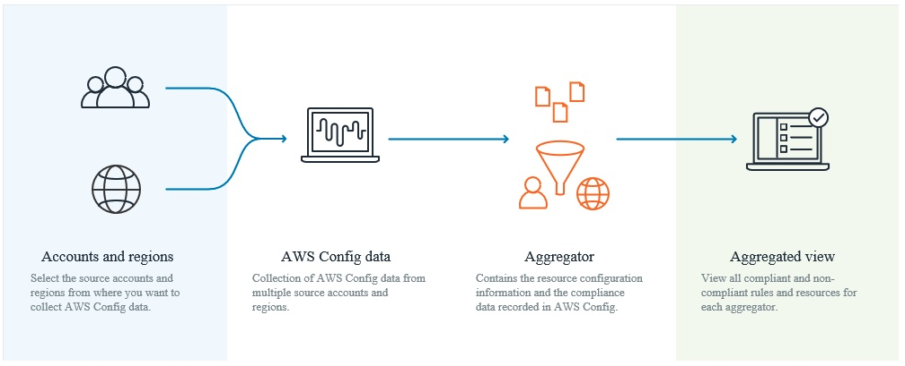
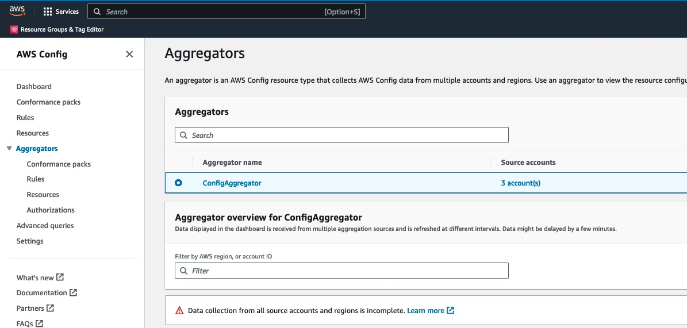

# Enrich AWS Health Events

You can enrich AWS Health Events with additional data such as Resource Tags, Resource Arn, Resource Availability Zone etc. AWS Heidi uses an AWS Config aggregator to extract the resource configuration recorded in AWS Config.

# Prerequisite:

You must have AWS Config aggregator setup before enriching the events. An AWS Config aggregator is an AWS Config resource type that collects AWS Config configuration from Multiple accounts and multiple regions. It gives view single view of all AWS resources running in your account.

 

AWS Config aggregator can be setup in central account where AWS Heidi central account setup is deployed, or it can be any other account. Incase AWS Config aggregator is deployed in different account, cross account IAM role is required to access aggregator data. OneClickSetup.py has option (Options 3) to create cross account role.

If you have not setup AWS Config Aggregator, you can follow this document. https://docs.aws.amazon.com/config/latest/developerguide/setup-aggregator-console.html

# Finding Information

If you already have AWS Config aggregator setup. You need to find aggregator name and aggregator region. Follow below steps to get that informaiton:

1. Login to AWS Config aggregator account.
2. Navigate to AWS Config console.
3. Click on Aggregators on left and find name of the Aggregators, as show below.

# Limitation
The data obtained from AWS Health events occasionally arrives in a non-ARN format. AWS Heidi conducts a comparison of the Affected Entity with the resourceName, ResourceID, and ResourceArn. This could return multiple rows. To suppress misleading data, enrich data will not be enriched for those resource which has duplicate names. Cross check AWS Config aggregator with following query. Go to aggregator account, nevigate to  AWS Config Console run following in query editor. 

`SELECT * WHERE resourceId = '<affectedEntity>' or resourceName = '<affectedEntity>' or arn = '<affectedEntity>'`

We recognize this constraint and are actively addressing it.