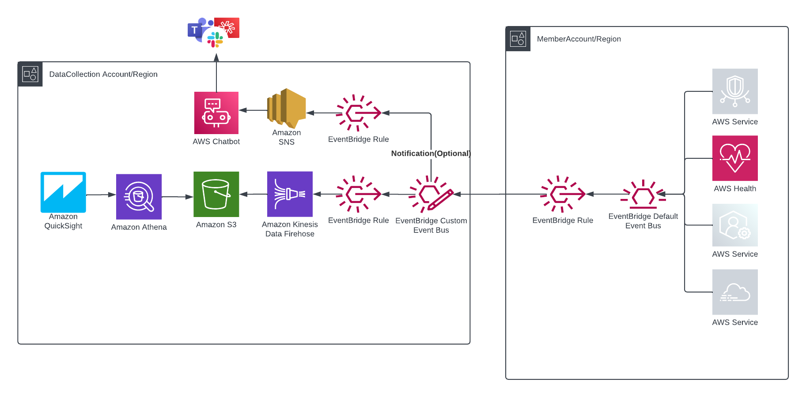

# Overview

Heidi can send incoming event notification to slack/teams/chime. AWS Chatbot is an AWS service that enables DevOps and software development teams to use messaging program chat rooms to monitor and respond to operational events in their AWS Cloud. AWS Chatbot processes AWS service notifications from Amazon Simple Notification Service (Amazon SNS), and forwards them to chat rooms so teams can analyze and act on them immediately, regardless of location.

 

# Slack Notification Setup

Heidi will setup all required resources through cloudformation template. If this is first time setup, Slack Workspace setup/OAuth authorization must be done from AWS console.
1. Open the AWS Chatbot console at https://console.aws.amazon.com/chatbot/\
2. Under Configure a chat client, choose Slack, then choose Configure client.\
3. From the dropdown list at the top right, choose the Slack workspace that you want to use with AWS Chatbot and Choose Allow.
4. Proceed to OneClickSetup script and provide all necessary informaiton.

# Teams notification Setup

Similar to Slack setup, If this is first time setup for MS Teams, Team Workspace setup/OAuth authorization must be done from AWS console.\
1. Open the AWS Chatbot console at https://console.aws.amazon.com/chatbot/.\
2. Under Configure a chat client, choose Microsoft Teams, then choose Configure client.\
3. Copy and paste your Microsoft Teams channel URL. Your channel URL contains your tenant, team, and channel IDs.\
4. Choose Configure and On the Microsoft Teams authorization page, choose Accept.\
5. From the Microsoft Teams page, choose Configure new channel.
6. Proceed to OneClickSetup script and provide all necessary informaiton.

# Additional Reading

1. To setup AWS Chatbot with Slack, please visit this this step by step tutorial: [Chatbot-Setup-with-slack](https://docs.aws.amazon.com/chatbot/latest/adminguide/slack-setup.html).
2. To setup AWS Chatbot with Amazon Chime, please visit this this step by step tutorial: [Chatbot-Setup-with-chime](https://docs.aws.amazon.com/chatbot/latest/adminguide/chime-setup.html).
3. To setup AWS Chatbot with Teams, please visit this this step by step tutorial: [Chatbot-Setup-with-teams](https://docs.aws.amazon.com/chatbot/latest/adminguide/teams-setup.html).

# Setting up Filters

By default, all the events going to centerlized event bus will be routed to your notification channel. If you want specific events, you can set filter on SNS subscriptions. 

[Filter-Events](https://docs.aws.amazon.com/sns/latest/dg/sns-subscription-filter-policies.html)