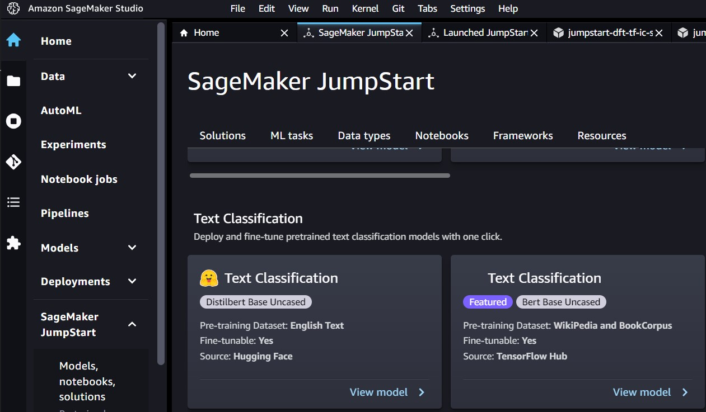
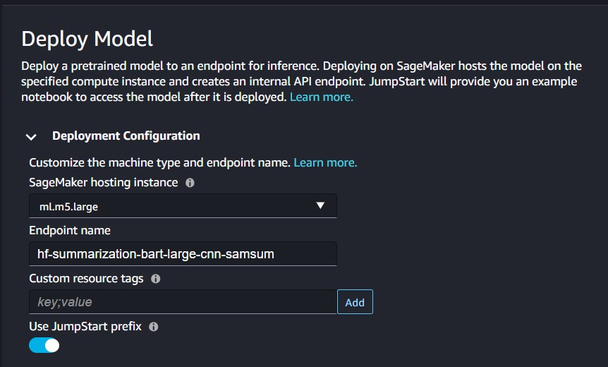
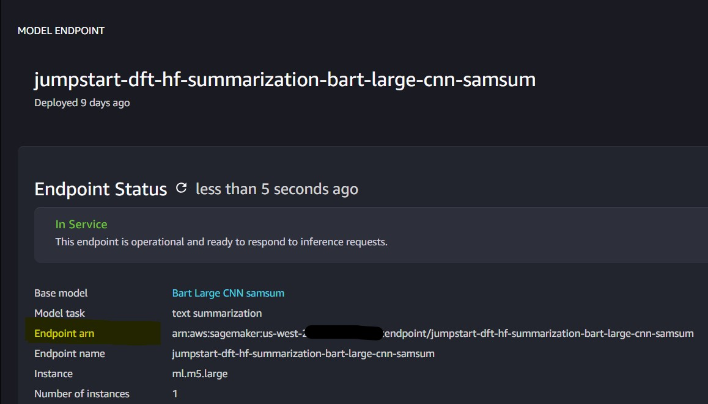

# (Optional) Setup a SageMaker JumpStart text summarization model to summarize health events

This solution can be optionally integrated with a SageMaker JumpStart text summarization model, which assists the end users to get a summary of each event from its event description. To incorporate event summarizations, you have the flexibility to utilize Amazon Sagemaker Large Language Model (LLM). For this sample, we used `huggingface-summarization-bart-large-cnn-samsum`. You can also choose to use an existing text summarization model provided you have an in-service SageMaker real-time inference endpoint. You need the SageMaker Inference Endpoint ARN to include this functionality.

To deploy a SageMaker JumpStart text summarization model using the AWS Console, follow the steps below:

1. Open your AWS Console and browse to *Amazon SageMaker* service.

**Note:** Currently, you need to use the same account and region that is your _Central Account_ and where the event processing Lambda function resides.

2. Open *SageMaker Studio*. If you haven't had an exisiting SageMaker Studio, follow the prompt to create a SageMaker domain. Consult your administrator on your organization requirements for choosing between quick and standard setups.

3. On the Home page of Amazon SageMaker Studio, click on *JumpStart* and scroll down to the _Text Summarization_ section. Pick a text summarization model of your choice, e.g. Bart Large CNN samsum.

4. On the new tab opened, review the deployment configuration and security settings and make necessary changes before clicking *Deploy*. 

**Note:** This solution has been tested on a SageMaker hosting for inference on `ml.m5.large` with the Bart Large CNN samsum model and it performed real-time synchronous inference in about 15-30 seconds per event.

5. Wait for the model endpoint to be _InService_. You can check the status from *Launched JumpStart assets* -> * Model endpoints* and find the name of the endpoint you just deployed. Click on the name and note down the ARN as you will need it as an input to the health dashboard deployment.

For more information about SageMaker JumpStart, please refer to the [AWS documentation](https://docs.aws.amazon.com/sagemaker/latest/dg/studio-jumpstart.html).